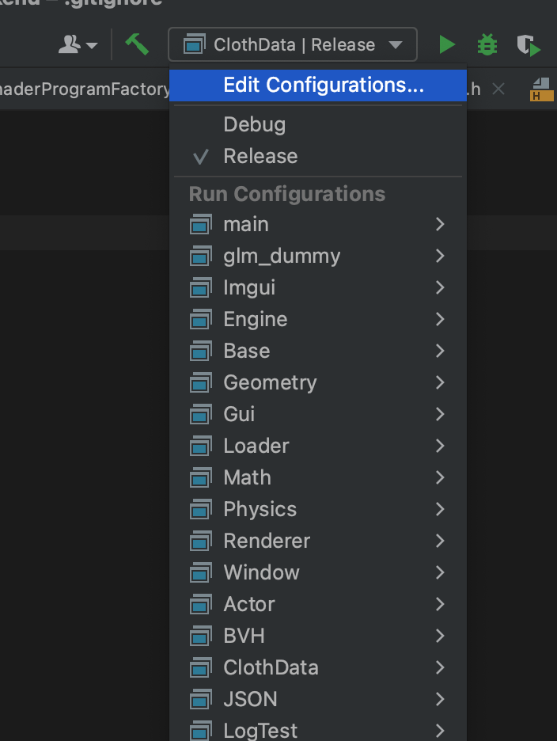
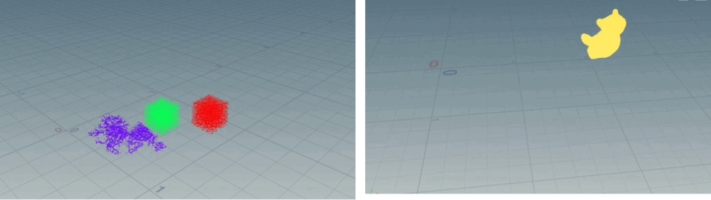
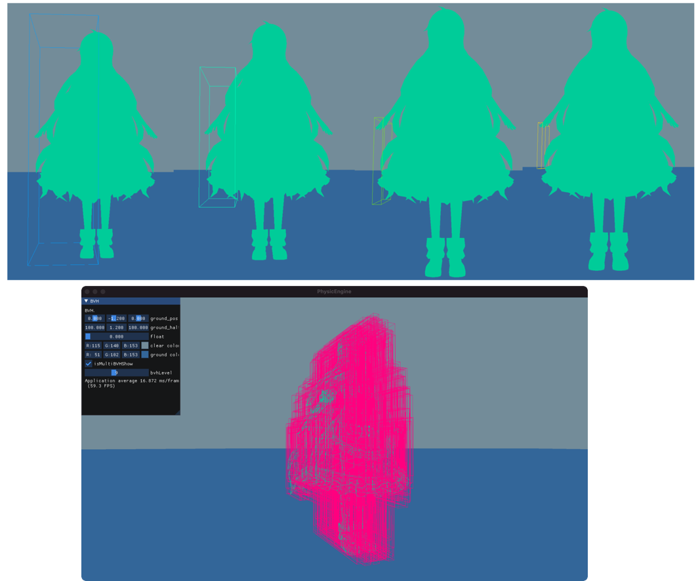
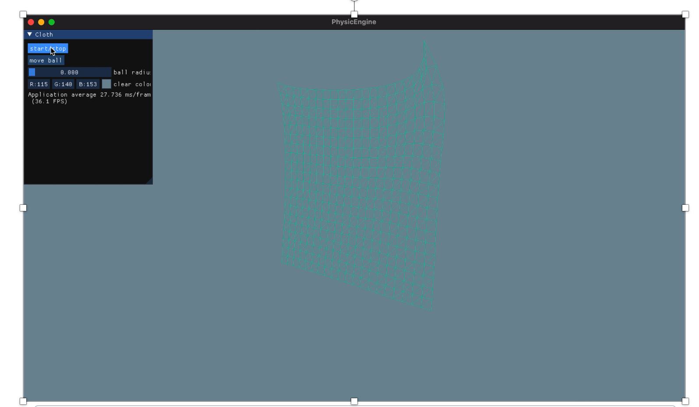

这是一个简单的物理引擎，用于模拟基本的物理效应。该引擎旨在为开发者提供一个轻量级的解决方案，用于实现基本的物理交互。

## GitHub链接

https://github.com/CanoeByGuitar/GamePhysicsEngine

## 安装教程

1. 克隆仓库到本地:

   ```bash
   git clone git@github.com:CanoeByGuitar/GamePhysicsEngine.git
   ```

2. 进入克隆的仓库目录:

   ```bash
   cd your_repository
   ```

## 软硬件环境

- 操作系统: MacOS或Ubuntu22.04
- 编译器: 支持 C++17 的编译器(clang / gcc)
- 依赖OpenGL、GLFW、TBB


在 Ubuntu 上安装 OpenGL、GLFW 和 TBB 的命令如下(Mac上类似，请前往官网查看安装教程，由于作者不会windows，故不提供windows支持)：

1. 安装 OpenGL 相关库:

   ```bash
   sudo apt-get install libgl1-mesa-dev
   ```

2. 安装 GLFW 库:

   ```bash
   sudo apt-get install libglfw3-dev
   ```

3. 安装 TBB（Intel Threading Building Blocks）库:

   ```bash
   sudo apt-get install libtbb-dev
   ```

这些命令将会安装所需的库和开发文件，以便在 Ubuntu 系统上使用 OpenGL、GLFW 和 TBB。

## 编译过程

我们使用 CMake 来管理项目的构建过程。请按照以下步骤进行编译:

1. 确保已经安装了 CMake。你可以通过终端输入以下命令来检查:

   ```bash
   cmake --version
   ```

   如果没有安装，请根据你的操作系统选择合适的安装方法。

2. 在项目根目录下创建一个构建目录，并进入该目录:

   ```bash
   mkdir build
   cd build
   ```

3. 运行 CMake 生成构建系统:

   ```bash
   cmake ..
   ```

4. 使用生成的构建系统进行编译:

   ```bash
   make
   ```

5. 编译完成后，你将在构建目录中找到可执行文件，可以直接运行。

## 使用示例

以CLion作为IDE为例

目前提供的上层应用主要为BVH和CLothData，点击即可运行



注意场景文件需仿照resource/config/example.json编写，并在主函数中显示修改路径。以下为实例








## 贡献

欢迎对该项目进行贡献！如果你有任何建议或发现了 bug，请通过 GitHub 上的 Issues 功能向我报告。我将非常感谢你的帮助。

## 许可证

该项目基于 [MIT 许可证](https://opensource.org/license/mit/)。请查阅许可证文件以获取更多信息。

